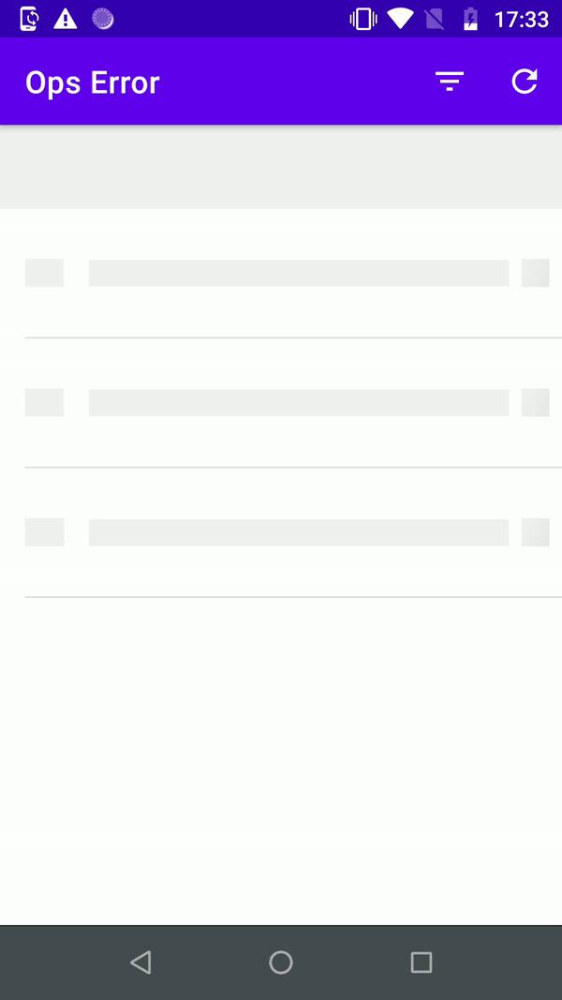

# Ops Error

This app returns error counts and
details of a monitoring system.

# Demo

# Stacks
* MVVM pattern (Model-View-Model)
* Dependency Injection using Koin
* Flow
* Coroutines
* Retrofit 
* ViewModels
* Jetpack navigation
* Databinding
* Viewbinding
* Moshi
* Safe Args
* Material Design
* Shimmer Recycler view
* Support screen orientation changes without losing status
* Unit test using JUnit, 
* Ui tests with Espresso and Robot pattern
* Mockk 
* And others...

